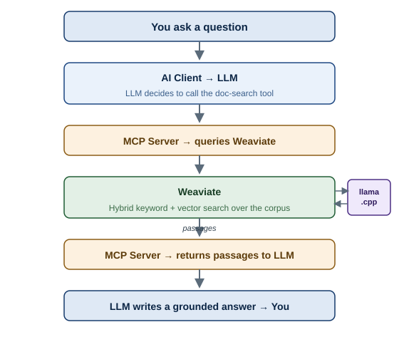
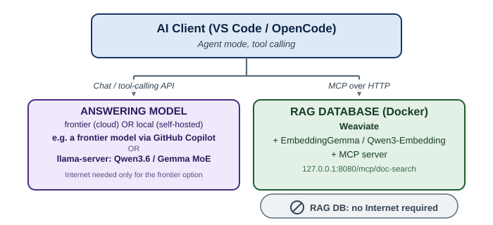
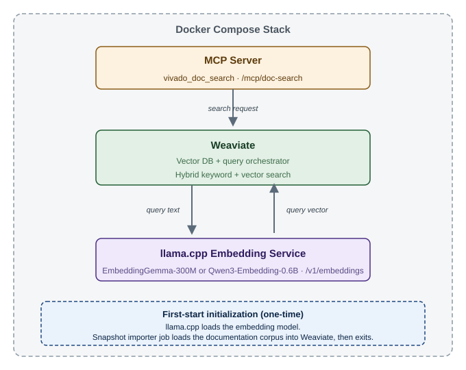

<!--
Copyright (C) 2026, Advanced Micro Devices, Inc. All rights reserved.
SPDX-License-Identifier: MIT
-->

# AMD Embedded — Locally Deployable RAG Database

**A fully air-gapped, self-hosted Retrieval-Augmented Generation (RAG)
database for AMD Embedded documentation — the retrieval layer only, with no
outbound network calls at runtime.**

This document covers everything that is **common regardless of which model
answers your questions afterward** — a local LLM on GPU-class hardware, or
a frontier cloud model like GitHub Copilot. That choice is covered in the
two companion documents linked below; this one is only about the RAG
database itself: why it exists, how it works, and how to deploy it.

The documentation corpus covers the full range of content published by the
AMD Embedded team — not just Vivado. This includes **Vivado**, **Vitis**,
**Power Design Manager (PDM)**, **ChipScope**, **System Software**,
**example designs**, **Wiki** pages, and **Answer Records**.

!!! note "Part of a 3-document set — this is document 1 of 3"
    This is part of a 3-document set. Jump directly to:

    - [Frontier Model](frontier-model.md) — use this RAG database with a frontier
      cloud model (no GPU/local-LLM hardware required)
    - [Local LLM](local-llm.md) — deploy a fully air-gapped local LLM (AMD ROCm)
      alongside this database

---

## 1. Overview { #1-solution-overview }

### 1.1 The Problem { #11-the-problem-in-plain-language }

Engineers ask their AI assistant (VS Code, OpenCode, etc.) questions like
*"Why does Vivado report a hold-time violation on a clock-domain-crossing
path, and how do I fix it?"* A general-purpose AI model was trained on a
snapshot of data up to some cutoff date — it may not reflect documentation
published after that cutoff, it often lacks the specific, authoritative
detail found across AMD's documentation set, and worse, when it doesn't
actually know something it can still generate a confident,
plausible-sounding, **wrong** answer (commonly called a "hallucination").

This solution fixes that by giving the AI model a **searchable,
trustworthy, and current library of real AMD Embedded documentation** to
consult before it answers. The database that makes this possible runs
**entirely on your own machine**, with nothing ever sent to the internet —
**regardless of which model you use to generate the final answer.**

> **Important distinction up front:** *this* database is air-gapped no
> matter what. Whether your *overall workflow* is air-gapped depends on
> which model you pick to generate answers — see
> [§1.4](#14-two-ways-to-supply-the-answering-model).

### 1.2 Key Concepts { #12-key-concepts-explained-simply }

??? note "New to Agentic AI, RAG, or embeddings? Expand for a plain-language primer"
    These are the building blocks used throughout this document, explained
    without assuming prior knowledge.

    **Large Language Model (LLM).** An LLM (Qwen, Gemma, GPT, Claude, etc.) is
    software trained on enormous amounts of text that can read a question and
    generate a human-like answer. Think of it as an extremely well-read intern:
    fluent, fast, and good at explaining things — but its knowledge is frozen at
    whatever point it was trained, and by itself it cannot look anything up.
    This document treats the LLM as a **pluggable component** — it doesn't
    matter whether it runs on your laptop's GPU or in a cloud data center; the
    RAG database talks to it the same way either way.

    **Agentic AI / Agent mode.** Ordinarily, chatting with an LLM is one-way:
    you ask, it answers purely from what it memorized during training.
    *Agentic AI* means the model can take actions instead of just talking — it
    can decide "I don't actually know this, let me use a tool to find out,"
    invoke that tool, read the result, and use it to write a better answer.
    This capability is usually exposed to you as **"Agent mode"** in tools like
    VS Code or OpenCode.

    **Tool calling.** The mechanism that makes Agentic AI possible. A *tool* is
    simply a function the model is told about — e.g. "here is a tool called
    `doc-search` that takes a question and returns documentation passages." A
    tool-calling-capable model recognizes when a tool would help, calls it
    automatically mid-conversation, and folds the result into its answer. Every
    mainstream frontier model (GitHub Copilot's models, Claude, GPT) supports
    this natively; local models vary in how reliably they do it, which is why
    model choice matters for local deployments (see the
    [Local LLM document](local-llm.md)).

    **Retrieval-Augmented Generation (RAG).** This is the overall pattern the
    whole solution implements, and where the "RAG" in this document's title
    comes from. Instead of relying only on what the LLM memorized during
    training, RAG **retrieves** relevant, real passages from a trusted source
    right before the model answers, and inserts them into the conversation as
    extra context — the model's generation is *augmented* with retrieved
    facts. The result: answers are grounded in real, current, sourced
    documentation rather than the model's frozen memory, and you can trace an
    answer back to the exact document it came from.

    **Embeddings & vector databases.** Computers can't directly compare the
    *meaning* of two pieces of text — meaning has to be turned into numbers
    first. An **embedding model** (this solution ships with a choice of two —
    see [§1.5](#15-choosing-an-embedding-model-package)) converts a chunk of
    text into a long list of numbers (a "vector") that captures its semantic
    meaning: two passages about similar topics end up with similar vectors,
    even if they don't share any of the same words. A **vector database** (this
    solution uses Weaviate) stores millions of these vectors and can instantly
    find the ones closest in meaning to a new query's vector. This is what lets
    the assistant find the *right* documentation passage even when your
    question is phrased completely differently from the manual.

    **How is an embedding model different from the LLM that answers you?**
    This is the most common point of confusion, so it's worth being explicit:
    this solution always uses **two different models, for two different
    jobs** — and only one of them ("the LLM") is the one you get to choose
    between local and frontier.

    | | Embedding model (e.g. EmbeddingGemma, Qwen3-Embedding) | The LLM that answers you (local *or* frontier) |
    |---|---|---|
    | **Job** | Turns text into a vector of numbers | Reads text and generates new text |
    | **Output** | A list of ~hundreds of numbers — not human-readable | A conversational, human-readable answer |
    | **Size** | Small (300M-600M parameters, a few hundred MB to ~1.2 GB) | Varies — tens of GB if local, unknown/irrelevant if a cloud frontier model |
    | **Can it chat or reason?** | No — it has no notion of a "conversation," it only measures similarity of meaning | Yes — this is what actually writes the answer you read |
    | **Can it search millions of documents fast?** | Yes — that's its entire purpose | Not practically — far too slow/expensive to compare raw text this way |
    | **Where it runs** | Always local — inside the Docker stack (§2.2) | Your choice — see [§1.4](#14-two-ways-to-supply-the-answering-model) |

    In short: the **embedding model is the librarian's index card system** — it
    doesn't understand your question in the way a person does, but it's
    extremely fast at finding "which documents are about the same topic as
    this." **Whichever LLM you choose is the person who actually reads what
    the librarian hands over and explains it to you in plain English.** Neither
    one can do the other's job — which is exactly why RAG wires the two
    together instead of relying on just one model. This document is entirely
    about the librarian (the embedding model + vector database + MCP server);
    it never assumes anything about which "person" (LLM) you've chosen.

    **Model Context Protocol (MCP).** A standard, model-agnostic way for AI
    clients (VS Code, OpenCode, Claude, etc.) to discover and call *external
    tools*, regardless of what language or platform those tools are built in.
    Rather than every AI application needing custom, one-off integration code
    per tool, MCP defines a common protocol: a tool "server" advertises what it
    can do, and any MCP-compatible client can call it the same way. In this
In this solution, the `amd-embedded-doc-search` MCP server exposes exactly one tool — searching
    the AMD Embedded documentation corpus. **Any** MCP-compatible client/model
    combination can use it, local or cloud.

### 1.3 Worked Example { #13-how-the-pieces-fit-together-a-worked-example }

Suppose you ask: *"Why does Vivado report a hold-time violation on a
clock-domain-crossing path, and how do I fix it?"*



Step by step, that diagram is:

1. Your AI client (VS Code Agent mode or OpenCode) sends the question to
   the LLM you've configured — local or frontier, it makes no difference
   to the steps that follow. The LLM recognizes it doesn't have enough
   specific information, and calls the `vivado_doc_search` tool over MCP —
   instead of guessing.
2. The MCP server forwards your question text to Weaviate. Weaviate's
   configured vectorizer sends the query to the local llama.cpp embedding
   service, which converts it into a vector. Weaviate then performs a
   hybrid search — keyword and vector similarity — against millions of
   pre-computed vectors already stored in its database. The corpus was
   built from AMD Embedded's Vivado, Vitis, PDM, ChipScope, System
   Software, example designs, Wiki, and Answer Records content.
3. The matching documentation passages are returned through the MCP server
   back to the LLM.
4. The LLM reads those passages and writes a final answer, grounded in —
   and typically citing — the actual documentation, instead of relying on
   whatever it vaguely remembers from training.

The retrieval step itself (step 2: vectorize → hybrid search → return
passages) is
consistently fast — typically well under a second, since the embedding
model is small (~300 MB) and the vector search is a local, in-memory
lookup. Total round-trip time then depends on which LLM generates the
answer — see the [Frontier Model](frontier-model.md) or
[Local LLM](local-llm.md) guide for that half of the picture.

### 1.4 Answering Model { #14-two-ways-to-supply-the-answering-model }

Everything above — vector database, embedding model, and MCP server — always
runs locally. Your only choice is **where the model that writes the final
answer runs**:



The RAG database (deployed below) is the same for both options — only the
answering model differs:

| | **[Frontier model](frontier-model.md)** (Option A) | **[Local LLM](local-llm.md)** (Option B) |
|---|---|---|
| Answering LLM runs | Cloud (e.g. GitHub Copilot in VS Code) | On your machine (`llama-server`) |
| Hardware | Any laptop — **no local GPU** | GPU-class (ROCm or Vulkan capable; this guide is written and tested for **AMD ROCm**) |
| End-to-end air-gapped? | **No** — the question + retrieved passages go to the cloud model | **Yes** — zero outbound network |
| Choose when | Fastest start, or no local GPU | Full air-gap is required |

### 1.5 Embedding Packages { #15-choosing-an-embedding-model-package }

This solution is delivered as a self-contained package **per embedding
model** — you receive **one** `Docs_<date>-<embedding-model>-<version>-amd64.tar.gz`
build (e.g. `Docs_07162026-embeddinggemma-300m-0.4.2-amd64.tar.gz`). Both are
fully self-hosted and air-gapped, and both install and operate
**identically**; every command in this guide (`amd-embedded-doc-search configure`,
`amd-embedded-doc-search start`, etc.) works the same regardless of which you
were given.

The embedding model **can affect retrieval quality**, but a head-to-head
comparison for this corpus is **not yet published** (planned for a future
release). Until then, if you get to choose, decide on **license** or
**download size** — otherwise use the one supplied to you.

| | `embeddinggemma-300m` | `qwen3-embedding-0.6b` |
|---|---|---|
| Embedding model | Google EmbeddingGemma-300M (Q8_0) | Qwen3-Embedding-0.6B (f16) |
| License | Gemma Terms of Use | Apache 2.0 |
| Download size | ~3.1 GB | ~4.4 GB |

For **setup**, the two are interchangeable — the same commands and file
layout apply; only the archive filename and the model file under `models/`
differ (see [§2.4](#24-file-layout-on-disk) and
[§3.1 Step 1](#31-phase-1-connected-machine-build-the-transfer-bundle)).

---

## 2. Architecture

### 2.1 Docker Basics { #21-docker-containers-in-plain-language }

Before looking at the stack itself, it helps to clear up a common point of
confusion: **"Docker" is not a container — it's the platform that runs
containers.** A single Docker installation on one machine can run many
containers at the same time, each fully isolated from the others.

- A **container** is a lightweight, self-contained package: an application
  plus everything it needs to run (libraries, configuration, dependencies) —
  but *not* a full operating system. Think of it like a shipping container
  (where Docker gets its name and logo): a standardized box that can be
  built once, moved anywhere, and run the same way regardless of what's
  inside or what machine it's placed on.
- **Docker** (or more precisely the *Docker Engine*) is the software
  installed on your machine that knows how to build, start, stop, and
  isolate these containers.
- **Docker Compose** is a tool for describing a *group* of related
  containers — which images to run, how they're networked together, which
  ports they expose — in a single file (`docker-compose.yml`), and starting
  or stopping all of them together with one command. A group of containers
  managed this way is often called a **stack** or **project**.

A single Docker installation can absolutely run multiple containers side by
side — and that's exactly what happens here. This solution's
`amd-embedded-doc-search` stack is one Docker Compose project made up of **three separate
containers** (Weaviate, llama.cpp, and the MCP server), each running in its
own isolated process, started and stopped together, but independently
replaceable and independently restartable if one of them needs attention.

### 2.2 Docker Stack { #22-the-docker-stack-3-containers }



| Container | Image | Role |
|-----------|-------|------|
| **Weaviate** | `cr.weaviate.io/semitechnologies/weaviate:1.38.2` | Vector database and query orchestrator. Its `text2vec-openai` vectorizer calls llama.cpp for query embeddings, then Weaviate performs hybrid keyword/vector search over the imported corpus. |
| **llama.cpp** | `ghcr.io/ggml-org/llama.cpp:server` | Long-running embedding service. Loads EmbeddingGemma-300M or Qwen3-Embedding-0.6B at startup and converts query text to vectors through `/v1/embeddings`. Small footprint (a few hundred MB to ~1.2 GB model, CPU-only by default). |
| **MCP Server** | `vivado.amd.com/doc-search-mcp-server:0.9.0` | Exposes the `vivado_doc_search` tool over MCP HTTP transport (named `vivado_doc_search` for client compatibility, but it searches the entire AMD Embedded corpus, not Vivado alone). It sends search requests to Weaviate and returns its results. |
| **Snapshot importer** *(first start only)* | `vivado.amd.com/doc-search-snapshot:Docs_07162026-<embedding-model>` | One-shot job container. Waits for Weaviate, creates/configures the collection, and loads the pre-vectorized documentation snapshot. It exits after successful import. |

None of these three containers is an LLM — this stack is **retrieval
only**. The model that reads the retrieved passages and writes an answer
lives outside this stack entirely (see [§1.4](#14-two-ways-to-supply-the-answering-model)).

### 2.3 Components { #23-components-in-detail }

- **Embedding model**: one of two self-hosted options depending on the
  package you were supplied (see [§1.5](#15-choosing-an-embedding-model-package)):
  Google EmbeddingGemma-300M, quantized to Q8_0 (GGUF),
  `models/embeddinggemma-300M-Q8_0.gguf` (~330 MB); or Qwen3-Embedding-0.6B,
  f16 (GGUF), `models/Qwen3-Embedding-0.6B-f16.gguf` (~1.2 GB). Either
  converts natural-language queries into vectors for similarity search.
  Runs via llama.cpp's built-in HTTP server — no Python, no GPU required.
- **Documentation database**: Weaviate, loaded with a curated,
  pre-vectorized snapshot of the **full AMD Embedded documentation set**:
  Vivado, Vitis, Power Design Manager, ChipScope, System Software, example
  designs, Wiki pages, and Answer Records — shipped as a Weaviate snapshot
  and imported automatically on first `amd-embedded-doc-search start`. During queries,
  Weaviate calls the configured local llama.cpp embedding endpoint and then
  performs hybrid keyword/vector search.
- **MCP server**: exposes `vivado_doc_search` at
  `http://127.0.0.1:<port>/mcp/doc-search` over the Model Context Protocol —
  usable by any MCP-compatible client (VS Code Agent mode, OpenCode, etc.),
  whichever model that client is talking to. It contacts Weaviate, not the
  embedding service directly.
- **The answering LLM** (external to this stack, by design): this stack
  provides **retrieval only** — you supply a separate model to generate
  answers, either a [frontier cloud model](frontier-model.md)
  or a [local LLM](local-llm.md). Whichever you pick, it
  **must support tool calling** so it can invoke the `vivado_doc_search` tool.

  > **Why not a code-focused model?** Code models tend to answer from
  > training data instead of calling the search tool, producing plausible
  > but potentially wrong answers. Use a tool-calling/instruction-following
  > model so the assistant actually searches the docs. This applies to both
  > frontier and local model choices.

### 2.4 File Layout { #24-file-layout-on-disk }

```text
~/.config/amd-embedded-doc-search/   ← Generated by `amd-embedded-doc-search configure`
├── docker-compose.yaml            ← Stack definition
├── class-config.json              ← Vectorizer configuration
└── .env                           ← Ports, API keys, model settings

Package contents (each `Docs_<date>-<embedding-model>-<version>-amd64.tar.gz` archive, flat — no wrapping folder):
├── amd-embedded-doc-search        ← CLI binary (Linux)
├── amd-embedded-doc-search.exe    ← CLI binary (Windows)
├── README.md                      ← Generic amd-embedded-doc-search CLI reference
├── NOTICE                         ← Third-party licenses
├── models/
│   └── <embedding-model>.gguf     ← Embedding model (embeddinggemma-300M-Q8_0.gguf
│                                     or Qwen3-Embedding-0.6B-f16.gguf, per §1.5)
└── images/                        ← Pre-loaded Docker images
    ├── weaviate.tar                ← Weaviate vector database
    ├── llama.cpp.tar                ← llama.cpp embedding server (serves /v1/embeddings)
    ├── doc-search-mcp-server.tar    ← MCP server (exposes the vivado_doc_search tool)
    └── snapshot.tar                 ← Pre-vectorized documentation snapshot (a one-time job imports it into Weaviate on first start)
```

> **Note:** this guide is distributed alongside the archive, not inside it
> — the tarball itself only contains the items listed above.

---

## 3. Deployment { #3-air-gapped-deployment-guide-rag-database }

This guide is split into two phases, done in order, and only covers
deploying the **RAG database itself**. Whichever answering-model option
you pick ([frontier](frontier-model.md) or
[local](local-llm.md)) has its own client-connection steps in
its own document — come back here first.

- **Phase 1 — 🌐 Connected machine.** Download everything into a *transfer
  bundle* (a folder you move across the air gap). Nothing is installed
  here.
- **Phase 2 — 🔒 Air-gapped machine.** Install and configure everything
  from that transfer bundle.

> **Same machine for both phases? That's fine.** The two phases describe
> *network states*, not necessarily *two different machines*. If your
> policy allows it, you can temporarily connect the target machine to the
> Internet, complete Phase 1 directly on it (skipping the transfer-bundle
> copy step), then disconnect it (unplug the cable, disable Wi-Fi, remove
> the route — whatever "air-gapped" means in your environment) before
> starting Phase 2.

> **Deploying with a frontier model instead?** The RAG database itself is
> still deployed exactly as below (it never talks to the internet), but
> your *overall* environment won't be air-gapped once you connect a
> frontier model as the answering LLM — see
> [Frontier Model](frontier-model.md)
> for that (much shorter) path, which doesn't require Phase 1's
> Docker/LLM download steps below beyond the MCP package itself.

Decide up front which client you will use (VS Code or OpenCode), because it
changes what you download:

- **Option A — VS Code (recommended).** Most engineers already have it
  installed, it has a familiar GUI with a built-in Chat/Agent view. Works
  with either a frontier model (sign in normally) or a local model via
  **Bring Your Own Key (BYOK)** — no extra extension required either way.
- **Option B — OpenCode (optional).** A terminal-based AI client. Install
  it only if you specifically prefer a CLI-driven workflow over an IDE.

| You want | Download in Phase 1 | Install in Phase 2 |
|----------|---------------------|--------------------|
| AMD Embedded Documentation MCP (required, this document) | Step 1 | Step 2 |
| **VS Code** (recommended) | Step 2 | See client docs below |
| **OpenCode** (optional) | Step 3 | See client docs below |
| A local LLM (only if using the [Local LLM](local-llm.md) option) | See that document | See that document |

### 3.1 Phase 1 { #31-phase-1-connected-machine-build-the-transfer-bundle }

> **Getting the files across the air gap:** gather everything into one
> *transfer bundle* and move it using whatever transfer method your
> environment approves — a USB drive, a guarded/one-way file transfer, an
> approved secure share, etc.

Suggested folder layout:

```text
transfer/
├── MCP/                      (required)
│   └── Docs_<date>-<embedding-model>-<version>-amd64.tar.gz
│
├── Docker/                   (only if the target has no Docker)
│   ├── docker-<version>.tgz            (Engine static tarball — Linux)
│   └── docker-compose-linux-x86_64     (Compose plugin binary — Linux)
│                                        (or: Docker Desktop installer on Windows)
│
├── VSCode/                   (recommended)
│   └── code.deb  (or code.rpm / VSCodeSetup.exe)
│
├── OpenCode/                 (optional)
│   └── opencode.tar.gz
│
└── Lemonade/                 (only for the Local LLM option — see local-llm.md)
```

**Step 1 — Copy the AMD Embedded Documentation MCP package (required)**

Copy the `amd-embedded-doc-search` package supplied to you into `transfer/MCP/`. Its
file name looks like `Docs_07162026-embeddinggemma-300m-0.4.2-amd64.tar.gz`
or `Docs_07162026-qwen3-embedding-0.6b-0.4.2-amd64.tar.gz` (the middle
part names the embedding model built into the package — see
[§1.5](#15-choosing-an-embedding-model-package) for the difference; either
build works, use the one supplied to you).

!!! note "Where do I get this package?"
    The two RAG database tarballs are listed on the
    Downloads page, which has the
    download details. Pick **one** variant (they differ only by the bundled
    embedding model, per [§1.5](#15-choosing-an-embedding-model-package)),
    obtain it while you still have network access, and copy it into
    `transfer/MCP/`. You cannot fetch it later from the air-gapped side.

`amd-embedded-doc-search` is Docker-based (Weaviate + an embedding model + the MCP
server), so **the target machine must have Docker**. If it doesn't already
have Docker, add it to `transfer/Docker/`:

- **Linux (recommended):** the **Engine static tarball** (`docker-<version>.tgz`)
  from <https://download.docker.com/linux/static/stable/> plus the **Compose
  plugin binary** (`docker-compose-linux-x86_64`) from
  <https://github.com/docker/compose/releases>. The static tarball is
  self-contained, so it avoids the offline `.deb`/`.rpm` dependency problem.
- **Windows:** the Docker Desktop installer, from
  <https://docs.docker.com/desktop/setup/install/windows-install/>.

You do **not** need to stage any container images — the `amd-embedded-doc-search` package
already bundles them and loads them on first start.

**Step 2 — Download VS Code (recommended)**

Download the installer for the **target machine's** OS into `transfer/VSCode/`:

- Download page: <https://code.visualstudio.com/download>
- Windows: `VSCodeSetup.exe` · Ubuntu/Debian: `code.deb` · RHEL/Fedora: `code.rpm`

**Step 3 — Download OpenCode (optional)**

Only if you plan to use OpenCode instead of VS Code:

- Releases: <https://github.com/sst/opencode/releases>
- Docs: <https://opencode.ai/docs/>

**Step 4 — Confirm the transfer bundle is complete**

Before leaving the connected machine (you cannot download anything after
this point):

- ✅ `transfer/MCP/` — the AMD Embedded Documentation MCP package
- ✅ `transfer/Docker/` — Docker Engine + Compose (only if the target has no Docker)
- ✅ `transfer/VSCode/` — VS Code installer (if using VS Code)
- ✅ `transfer/OpenCode/` — OpenCode package (if using OpenCode)

If you plan to run a local LLM too, also gather the items listed in
[Local LLM](local-llm.md)'s transfer-bundle
section before leaving the connected machine.

Now move the bundle to the air-gapped machine and continue with Phase 2.

### 3.2 Phase 2 { #32-phase-2-air-gapped-machine-install-the-rag-database }

!!! warning "Known air-gap gotchas — skim these first"
    These failures show up only on locked-down, offline, or NFS-backed hosts —
    not on a normal connected laptop. Each is *symptom → cause → what to do*;
    adapt the specifics to your environment.

    - **`mcp` container stuck in `Created`** → the one-time documentation import
      is still running (~10 min) → wait; watch it with
      `docker logs -f amd-embedded-doc-search-weaviate-docs-import-1`. It starts on its own.
    - **Client can't reach the server (`HTTP 000`)** → `localhost` resolved to
      IPv6 `::1`, but Docker publishes on IPv4 → use **`127.0.0.1`** in the URL.
    - **`permission denied … mkdir …/models`** → your home is on NFS with
      `root_squash` (check `stat -f -c '%T' "$HOME"` → `nfs`) → keep deployment
      state on a **local disk**, not your NFS home — the quickest fix is
      `export XDG_CONFIG_HOME=/local/path` before running any
      `amd-embedded-doc-search` command; it redirects config/data generation
      away from `~/.config` entirely.
    - **`configure` fails with `could not open a new TTY`** → its interactive UI
      needs a **real terminal** → run it in an interactive shell (or drive it
      through a `pty` wrapper for automation).
    - **Offline `.deb`/`.rpm` install fails on dependencies** → package managers
      don't resolve deps offline → gather each package **with its dependencies**
      on the connected machine, or use **self-contained builds** (tarballs/static
      binaries).
    - **`docker ps` → `permission denied … docker.sock`** → you need **non-sudo
      Docker access** (the `docker` group) → on a secured host this is an admin
      action; ask your sysadmin.

**Step 1 — Install Docker (only if the machine doesn't already have it)**

`amd-embedded-doc-search` is a Docker-based stack (Weaviate + an embedding model + the MCP
server), so the target machine needs Docker. **Skip this step entirely if
`docker ps` already works.**

=== "Linux (static tarball)"

    Extract the Engine binaries onto your `PATH`:

    ```bash
    tar -xvzf transfer/Docker/docker-*.tgz
    sudo cp docker/* /usr/bin/
    ```

    Install the Compose plugin binary so `docker compose` works:

    ```bash
    sudo mkdir -p /usr/local/lib/docker/cli-plugins
    sudo cp transfer/Docker/docker-compose-linux-x86_64 \
        /usr/local/lib/docker/cli-plugins/docker-compose
    sudo chmod +x /usr/local/lib/docker/cli-plugins/docker-compose
    ```

    The static tarball does **not** include a systemd service file — create one
    so Docker starts on boot:

    ```bash
    sudo tee /etc/systemd/system/docker.service > /dev/null <<'EOF'
    [Unit]
    Description=Docker Application Container Engine
    After=network-online.target
    Wants=network-online.target

    [Service]
    Type=notify
    ExecStart=/usr/bin/dockerd
    Restart=always

    [Install]
    WantedBy=multi-user.target
    EOF
    ```

    Then enable and start Docker:

    ```bash
    sudo systemctl daemon-reload
    sudo systemctl enable --now docker
    ```

    Add your user to the `docker` group so you can run Docker without `sudo`,
    then **reboot** — a log out/log in is *not* sufficient for the new group
    membership to take effect:

    ```bash
    sudo groupadd docker
    sudo usermod -aG docker $USER
    sudo reboot
    ```

=== "Windows (Docker Desktop)"

    Run the **Docker Desktop** installer from `transfer/Docker/` (download it on
    the connected machine from
    <https://docs.docker.com/desktop/setup/install/windows-install/>). Docker
    Desktop bundles the Engine and the Compose plugin and runs them as a
    background service, so none of the Linux binary-copy, systemd, or
    `docker`-group steps are needed.

    When installation finishes and the Docker Desktop dashboard shows **Engine
    running**, continue.

Confirm Docker is working before continuing (Linux: no `sudo` needed):

```bash
docker ps
```

**Step 2 — Install the AMD Embedded Documentation MCP server (required)**

Extract the package you copied into `transfer/MCP/`, then check the environment
and bring the stack up. Unlike older drops, the archive is **flat** — it
extracts directly into the current directory, with no wrapping folder to `cd`
into:

```bash
tar -xvzf transfer/MCP/Docs_*.tar.gz
./amd-embedded-doc-search doctor            # verify Docker is ready
./amd-embedded-doc-search configure --start # generate config and start the stack
```

!!! note "On Windows"
    The `tar` command above is the same, but run the CLI with the `.exe` build
    from PowerShell — e.g. `.\amd-embedded-doc-search.exe doctor` and
    `.\amd-embedded-doc-search.exe configure --start`.

The MCP port is chosen during `configure` and saved in
`~/.config/amd-embedded-doc-search/.env` as `DOCSEARCH_MCP_PORT` (default `8080`):

```text
http://127.0.0.1:<DOCSEARCH_MCP_PORT>/mcp/doc-search
```

Full command reference, flags, validation, and troubleshooting:
**[Operate & Troubleshoot](operate.md)**.

**Step 3 — Connect an answering model**

Continue with whichever fits your hardware and network policy:

- [Frontier Model](frontier-model.md) —
  no local-LLM hardware required, works on any laptop
- [Local LLM](local-llm.md) — fully
  air-gapped end to end, requires GPU-class hardware

---

## 4. Next Steps { #4-where-to-go-next }

The RAG database is now deployed and validated. Pick your answering model:

- **No GPU / just want to try it quickly?** →
  [Frontier Model](frontier-model.md)
  (GitHub Copilot in VS Code, a few minutes of setup)
- **Need a fully air-gapped end-to-end deployment?** →
  [Local LLM](local-llm.md) (AMD ROCm,
  includes local-LLM setup and VRAM planning)

---

<p class="sphinxhide" align="center"><sub>Copyright © 2026 Advanced Micro Devices, Inc</sub></p>
<p class="sphinxhide" align="center"><sup><a href="https://www.amd.com/en/corporate/copyright">Terms and Conditions</a></sup></p>
