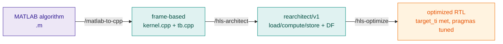
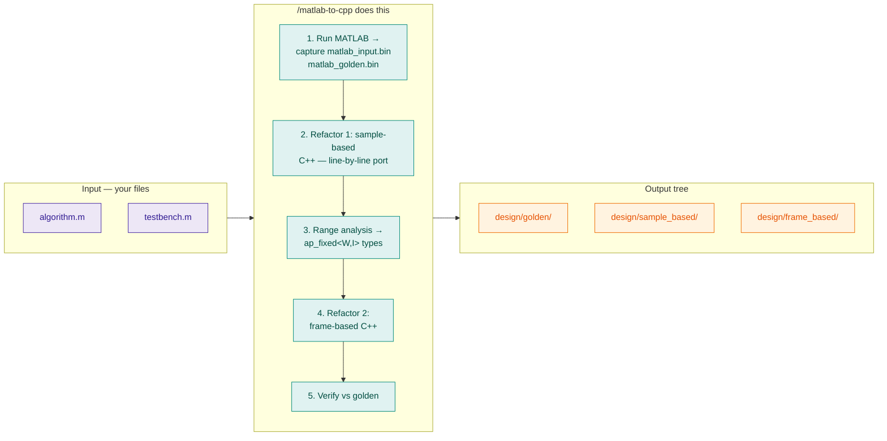
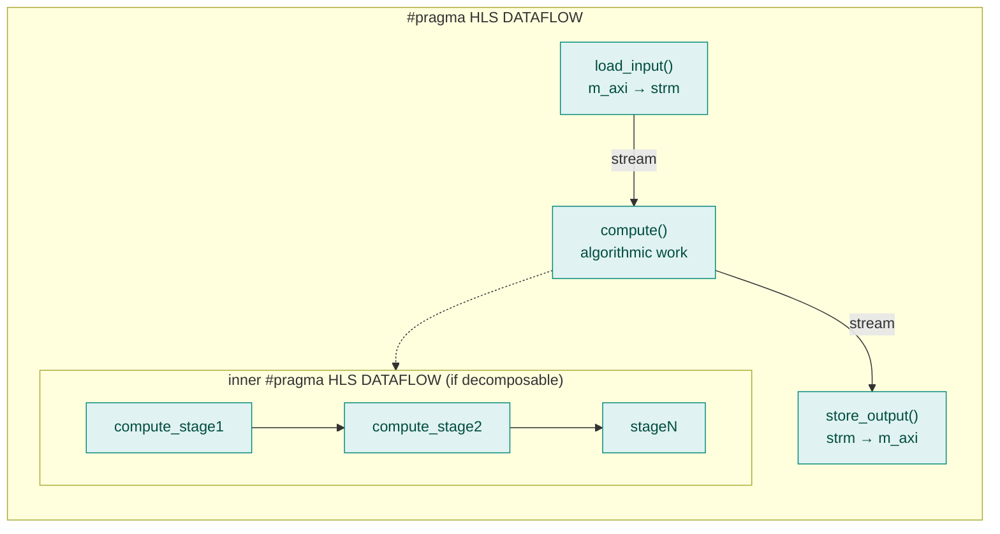
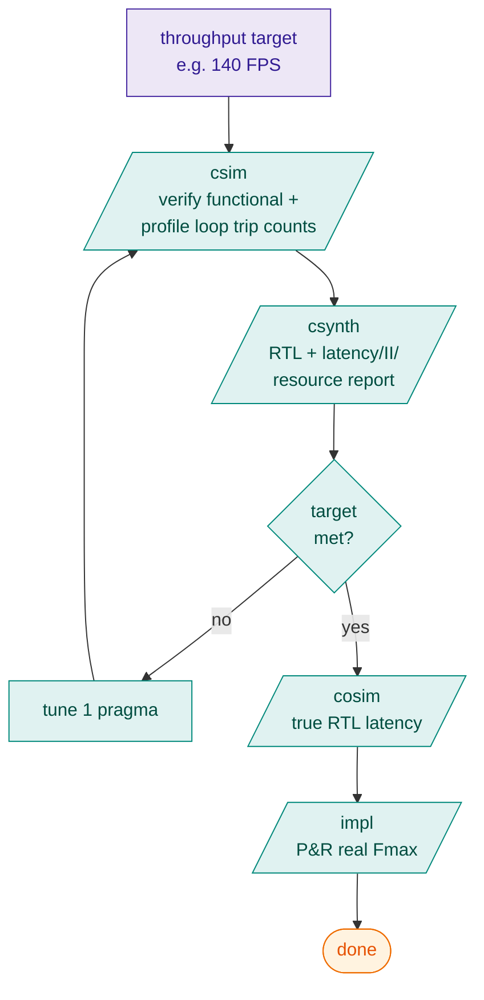

<!--
Copyright (C) 2026, Advanced Micro Devices, Inc. All rights reserved.
SPDX-License-Identifier: MIT
-->

# Agent Skills

Skills are reusable, task-focused playbooks that take an algorithm written in **MATLAB** or **C++** and walk it all the way to **synthesizable, optimized RTL** for AMD FPGAs using Vitis HLS. Each skill is a folder containing a `SKILL.md` (and optional helper scripts) that the agent loads on demand.

The skills are organized around three handoffs — each owned by a single core skill — plus a build skill and a set of validation / analysis skills called automatically by the cores.

## The Big Picture



Three handoffs, each owned by one skill:

| Handoff | Skill | Input | Output |
|---|---|---|---|
| **MATLAB → C++** | [`/matlab-to-cpp`](skills/matlab-to-cpp.md) | `algorithm.m` + golden test | `frame_based/kernel.cpp` (functionally identical, fixed-point types) |
| **C++ → HLS macro-architecture** | [`/hls-architect`](skills/hls-architect.md) | `frame_based/kernel.cpp` | `rearchitect/v1/kernel_hls.cpp` (load → compute → store, DATAFLOW) |
| **Macro-arch → optimized RTL** | [`/hls-optimize`](skills/hls-optimize.md) | `kernel_hls.cpp` + throughput target | Pragma-tuned source + RTL meeting `target_ti` |

---

## Stage 1 — MATLAB → C++ (`/matlab-to-cpp`)

Converts a sample-based MATLAB algorithm to frame-based C++ with **bit-exact fixed-point types**.



**Why two refactors?** The sample-based step preserves MATLAB semantics so divergence is caught early. The frame-based step is the shape HLS expects.

**Key artifact:** `frame_based/kernel.cpp` — passes the same golden as the MATLAB.

---

## Stage 2 — C++ → HLS Macro-Architecture (`/hls-architect`)

Converts the frame-based C++ into a producer-consumer HLS dataflow. The architect chooses **macro structure only** — pragmas like `PIPELINE` / `UNROLL` are deferred to `/hls-optimize`.



**The architect is allowed to write only:** `DATAFLOW`, `INTERFACE`, `STREAM depth=N`, `performance target_ti=N`.

**Key artifact:** `rearchitect/v1/src/kernel_hls.cpp` + `hls_config.cfg`. After this stage the architect saves a snapshot to `architect_baseline/` before handing off.

---

## Stage 3 — Optimization Loop (`/hls-optimize`)

Closes the loop between **what you target** and **what HLS achieves**. Iterates pragmas until the throughput target is met.



Each iteration changes **one thing** so cause-and-effect stays clean. Outcomes recorded in `perf_outcomes.md`.

---

## Skill Catalog

### Core Pipeline Skills

These are the main skills you'll invoke to go from algorithm to RTL:

| Skill | Purpose |
|---|---|
| `/setup` | Verify Vitis / MATLAB / OpenCV; discover design + build commands |
| [`/matlab-to-cpp`](skills/matlab-to-cpp.md) | MATLAB → frame-based C++ with `ap_fixed` types |
| [`/hls-architect`](skills/hls-architect.md) | Frame-based C++ → HLS dataflow macro-architecture |
| [`/hls-optimize`](skills/hls-optimize.md) | Iterate pragmas until throughput target met |

### Build Skills

| Skill | Purpose |
|---|---|
| [`/hls-run-flow`](skills/hls-run-flow.md) | Run csim, synthesis, cosim, implementation |

### Validation & Analysis Skills

Called automatically by `/hls-architect` and `/hls-optimize` to check code quality:

| Skill | Purpose |
|---|---|
| `/hls-perf-pragma`     | Cascade `target_ti` from top-level → loops |
| `/hls-dataflow`        | DATAFLOW canonical-form check |
| `/hls-synthesizable`   | Guards against unsynthesizable C++ |
| `/hls-burst-inference` | Verify AXI bursts will be inferred |
| `/hls-flattenable`     | Loop-nest flatten eligibility |
| `/hls-array-to-stream` | Opportunities to convert PIPO → stream |
| `/hls-stencil-pattern` | Stencil-shape recognition |
| `/hls-line-buffer`     | Stencil II=1 line-buffer recipe |

### Reference Documentation

Pattern guides (not invokable skills), shipped under `vitis-hls-ai-assistant-skills/hls-architect/reference/`:

- `vitis-libraries.md` — Study production HLS coding patterns
- `design-layout.md`   — Canonical directory tree structure

---

## How Skills Are Invoked

You don't have to call skills by name — the agent picks one when your prompt matches its trigger. But you can pin one explicitly, with arguments:

```
/hls-architect throughput=8x baseline
/hls-optimize xf_gtm_accel.cpp Reduce true-latency by 2x while using no more than 1.5x the resources
/matlab-to-cpp rgbEdgeDetector 4400 FPS part=xczu9eg-ffvb1156-2-e clock=3.3
```

Each skill is bounded: it refuses to take actions outside its scope (e.g. `/hls-run-flow` will not edit pragmas; `/hls-optimize` will not change functional C code unless explicitly authorized).

## MCP Server (Optional)

The Vitis HLS skills operate independently — they invoke `v++` / `vitis-run` directly via the IDE shell and parse reports without calling any MCP tool. The Vivado MCP Server is optional and serves a single purpose: documentation lookup via `vivado_doc_search`.

| Configuration | What You Get |
|---------------|-------------|
| **Skills only (default)** | Full HLS flow: csim, csynth, cosim, impl, pragma tuning, report parsing |
| **Skills + Vivado MCP Server** | Same flow plus AMD-doc-grounded answers citing UG1399, UG1391, HLS Methodology Guide |

<p class="sphinxhide" align="center"><sub>Copyright © 2026 Advanced Micro Devices, Inc</sub></p>
<p class="sphinxhide" align="center"><sup><a href="https://www.amd.com/en/corporate/copyright">Terms and Conditions</a></sup></p>
