<!--
Copyright (C) 2026, Advanced Micro Devices, Inc. All rights reserved.
SPDX-License-Identifier: MIT
-->

# AMD Adaptive SoC Multi-Agent Prototype v0.1

Status: v0.1 design baseline
Last updated: 2026-07-30

This document defines only the v0.1 prototype. It is the architecture source of truth for this version.

## Scope

v0.1 supports an end-to-end path from user intent to a verified AMD FPGA or
Adaptive SoC programming image. A hardware-qualified profile extends that path
through authorized on-target validation.

The default is a direct RTL-to-Vivado flow. Vitis HLS, AI Engine, PS software, and platform integration are conditional capabilities; their presence in the skill library does not cause them to be selected.

Regression cases with `hardware-test.json` use a hardware-ready build profile:
platform integration inserts the logical test shell and VIO/ILA, verification
checks the self-test oracle, and implementation emits the matching LTX and
final debug map. Programming and VIO drive remain a separate serialized
hardware-qualified stage.

v0.1 execution is validated with frontier models. Local-model execution is a later phase, but all handoffs use provider-neutral JSON schemas, bounded enums, typed leaf values, stable IDs, explicit revision links, and deterministic cross-artifact gates to avoid relying on frontier-only semantic recovery.

Every producer status is treated as a claim. Before work begins, the gate
runner hash-pins the declared inputs and captures the run's file state. At
handoff it independently validates ownership, schema, revisions, requirements,
stage-specific engineering evidence, output integrity, approvals, and declared
side effects. It then writes an immutable iteration receipt plus a generated
Markdown view. Only a PASS receipt authorizes the next agent.

The user enters with a natural-language request and may also provide an existing Vivado project, RTL, constraints, target part or board, test vectors, or acceptance criteria. The workflow asks focused questions only when an unresolved choice would materially affect the design.

The KV260 regression profile uses the conditional platform integration branch:

```text
orchestrator → intent-to-spec → architect → RTL engineer
             → platform integrator → verifier → implementation closure
```

Its case contract fixes board part `xilinx.com:kv260_som:part0:1.4`, device
`xck26-sfvc784-2LV-c`, the public custom-kernel interface, and IP-integrator
mode. The platform integrator owns the Zynq PS board preset, clocks, resets,
AXI connectivity, address assignment, block-design validation, HWH, and the
pre-implementation platform export. Implementation closure owns the final
fixed XSA after bitstream signoff. The implementation result must echo the
verified board part as structured data.

## v0.1 agent roster

v0.1 has six design-core agents, one hardware-profile core agent, and four
conditional implementation agents.

| Agent | Use | Duties | Primary skills |
|---|---|---|---|
| `amd_soc_orchestrator` | Core | Owns workflow state, selects agents, validates handoffs, manages bounded retries, routes failures, and reports completion. It does not perform specialist design work. | `vivado-workflow`, `soc-orchestration`, `vivado-revision-control` |
| `amd_soc_intent_to_spec` | Core | Converts user intent and existing-project evidence into a measurable hardware specification and acceptance criteria. Runs focused user Q&A for consequential ambiguity and uses Vivado MCP or documentation search to validate device- and tool-specific assumptions. | `vivado-intent-to-spec` |
| `amd_soc_architect` | Core | Defines the system architecture, interfaces, clocks, resets, data movement, latency/throughput goals, and resource budgets. Selects RTL, existing IP, HLS, AIE, or PS only when justified by the approved specification. | `vivado-design-architecture`, `workload-partition-advisor`, `soc-orchestration/partitioning`, `soc-orchestration/estimation` |
| `vivado_rtl_engineer` | Core | Refines the PL microarchitecture and creates handwritten SystemVerilog/Verilog, XDC, wrappers, and project Tcl. Resolves elaboration and source-level synthesis defects using Vivado MCP. | `vivado-source-authoring`, `rtl-elaboration-analysis`, `versal-rtl-coding-guidelines`, `versal-rtl-design-advisories` |
| `amd_soc_verifier` | Core | Builds independent tests, runs lint and functional simulation, checks interfaces and acceptance criteria, and routes defects to their owner. Uses cocotb/Verilator by default and Vivado MCP/XSim when AMD IP or implementation models require it. | `rtl-functional-verification`, `rtl-lint`, `axi4-debug-sim`, `vitis-functional-sim`, `vitis-hw-emu-solution` |
| `vivado_impl_closure` | Core | Runs Vivado synthesis, placement, routing, DRC, methodology, timing, utilization, congestion, and bounded closure loops. Produces the final `.bit` or `.pdi`, fixed XSA, matching `.ltx`, implemented debug map, and evidence-backed signoff report. | `vivado-implementation-closure`, `timing-methodology-checks`, `opt-design-analysis`, `phys-opt-design-analysis`, `congestion-analysis`, `device-floorplan`, `vivado-post-route-analyze`, `vivado-timing-closure` |
| `amd_soc_hardware_validator` | Core for hardware-qualified runs | Matches a closed image to a target capability profile, obtains hardware-action authorization, discovers SSH and JTAG independently, programs through an approved backend, drives safe VIO controls, captures bounded ILA evidence, runs PS/DMA tests when required, evaluates hardware criteria, and restores a safe state. | `hardware-validation`, `hw-vio-debug`, `hw-ila-debug` |
| `amd_soc_platform_integrator` | Conditional: PS/CIPS, block design, NoC, or Vitis platform | Configures Zynq PS or Versal CIPS, DDR, NoC, AXI ports, clocks, resets, interrupts, address maps, block designs, platform metadata, pre-implementation platform exports, logical VIO/ILA insertion, and system packaging plans. Uses Vivado MCP for block-design work, verifies IP settings against the live catalog and cell, and reports the realized clock and reset topologies. | `soc-orchestration/vitis-platform`, `ip-configurator`, `soc-orchestration/vitis-acceleration`, `segcfg-project-setup`, `vivado-bd-ila-insert`, `vivado-bd-vio-insert` |
| `vitis_hls_engineer` | Conditional: approved HLS component | Creates and optimizes HLS C/C++, interfaces, pragmas, tests, and an owned compile-plan fragment; the deterministic Vitis runner writes packaged build outputs. | `hls-architect`, `hls-run-flow`, `hls-synthesizable`, `hls-dataflow`, `hls-optimize`, and other relevant `hls-*` skills |
| `vitis_aie_engineer` | Conditional: approved AIE/AIE-ML component | Creates and optimizes AIE kernels, graphs, DSP Library components, constraints, stimuli, performance evidence, and an owned compile-plan fragment; the deterministic Vitis runner writes compiled outputs. | `create-kernel*`, `create-dsplib*`, `matlab-to-aie*`, `optimize-aie-*`, `extract-aie-*` |
| `vitis_sw_engineer` | Conditional: PS software | Creates BSP/driver/application sources, address-map headers, and the embedded application plan fragment; the deterministic Vitis runner writes the ELF and result. | `ps-software`, `vitis-embedded-app-generator`, `vitis-xsa-app`, `xsct-to-python-converter`, `segcfg-firmware-build` |

Each agent is implemented as a project-scoped Codex custom-agent file under `.codex/agents/`. The files do not pin a model, so all agents inherit the frontier model selected for the parent v0.1 run.

## Default direct-Vivado flow

Most users follow this six-agent path:

```text
User
  → amd_soc_orchestrator
  → amd_soc_intent_to_spec
  → amd_soc_architect
  → vivado_rtl_engineer
  → amd_soc_verifier
  → vivado_impl_closure
  → verified .bit or .pdi
```

The architect must not silently replace handwritten RTL with HLS. The HLS branch is selected only when:

- the user explicitly requests HLS or supplies an HLS-oriented C/C++/MATLAB component;
- the existing design already contains HLS that must be maintained;
- the approved specification permits implementation-technology selection and evidence supports HLS; or
- the architect proposes HLS because direct RTL is impractical and the user approves the change.

The same opt-in principle applies to AIE and PS software. PS/CIPS platform integration is selected when the approved specification actually requires those device subsystems.

For a hardware-qualified run, the design path continues:

```text
vivado_impl_closure
  → amd_soc_hardware_validator
  → hardware-validation-result.json
  → amd_soc_orchestrator
```

The hardware validator is never allowed to program a device or drive VIO
without explicit user authorization. A design-only run can still finish after
implementation; it must be labeled design-complete rather than
hardware-qualified.

## v0.1 workflow

```mermaid
flowchart LR
    subgraph ENTRY["User and orchestration"]
        U["User<br/>intent, sources, target,<br/>constraints, acceptance criteria"]
        O["amd_soc_orchestrator<br/>state, routing, gates,<br/>bounded retries"]
        Q["Focused user Q&A<br/>only for consequential ambiguity"]
        U --> O
    end

    subgraph CORE["Core design agents"]
        S["amd_soc_intent_to_spec<br/>hardware-spec.json"]
        A["amd_soc_architect<br/>architecture-plan.json<br/>work packages"]
        R["vivado_rtl_engineer<br/>RTL, XDC, Tcl,<br/>manifest fragment"]
        V["amd_soc_verifier<br/>lint, cocotb/Verilator,<br/>XSim when needed"]
        I["vivado_impl_closure<br/>synthesis, place, route,<br/>timing and DRC"]
    end

    subgraph OPTIONAL["Conditional specialist agents"]
        H["vitis_hls_engineer<br/>HLS C/C++, reports,<br/>packaged IP"]
        E["vitis_aie_engineer<br/>AIE kernels, graph,<br/>libadf and reports"]
        P["amd_soc_platform_integrator<br/>PS/CIPS, DDR/NoC, AXI,<br/>BD, addresses, platform export"]
        W["vitis_sw_engineer<br/>BSP, drivers, application,<br/>ELF and software manifest"]
        X["Headless Vitis runner<br/>typed plan, vitis -s,<br/>v++ compile/link/package"]
    end

    subgraph HARDWARE["Hardware-qualified profile"]
        HV["amd_soc_hardware_validator<br/>target preflight, programming,<br/>VIO, ILA, SSH and cleanup"]
        HQ["hardware-validation-result.json<br/>actual measurements and captures"]
    end

    G["Integration gate<br/>aggregate source-manifest.json<br/>PL-only owner: RTL engineer<br/>system owner: platform integrator"]
    D["Programming image and evidence<br/>.bit or .pdi, XSA,<br/>reports and metrics"]
    M["Vivado MCP shared service<br/>project/IPI actions, documentation,<br/>simulation and implementation evidence"]

    O --> S
    S -->|"material ambiguity"| Q
    Q -->|"user decision"| S
    S -->|"approved specification"| A

    A -->|"default RTL work package"| R
    A -->|"approved HLS work package"| H
    A -->|"approved AIE work package"| E
    A -->|"PS/CIPS/BD/NoC required"| P

    R --> G
    H --> G
    E --> P
    P --> G
    G -->|"integrated design"| V
    V -->|"verification PASS; no acceleration"| I
    V -->|"verification PASS; acceleration selected"| X
    P -->|"assembled typed plan"| X
    X -->|"PASS v++ compile/link/package evidence"| I
    I -->|"implementation PASS"| D
    I -->|"final fixed XSA; PS software required"| W
    W -->|"PASS XPFM/ELF evidence"| D
    D -->|"design-complete profile"| O
    D -->|"hardware-qualified profile"| HV
    HV -->|"hardware PASS"| HQ
    HQ --> O
    O -->|"status and artifacts"| U

    V -.->|"RTL defect"| R
    V -.->|"HLS defect"| H
    V -.->|"AIE defect"| E
    V -.->|"platform defect"| P
    V -.->|"software defect"| W
    V -.->|"specification or partition defect"| A
    I -.->|"RTL-rooted failure"| R
    I -.->|"platform-rooted failure"| P
    I -.->|"architecture, timing, or budget failure"| A
    HV -.->|"functional mismatch"| V
    HV -.->|"instrumentation/platform defect"| P
    HV -.->|"image/signoff defect"| I
    HV -.->|"target capability or equipment"| O

    M -.-> S
    M -.-> A
    M -.-> R
    M -.-> P
    M -.-> V
    M -.-> I
    M -.-> HV
```



## Vivado MCP policy

Vivado MCP is a workflow service, not a separate agent. Agents use it wherever Vivado evidence or actions are required:

| Stage | Vivado MCP use |
|---|---|
| Intent to specification | Inspect an existing project and validate target parts, boards, IP availability, and tool assumptions. |
| Architecture | Query device capabilities and validate Vivado-specific architectural assumptions. Use `vivado_doc_search` when exact behavior or commands are uncertain. |
| RTL engineering | Create or inspect projects, elaborate sources, compile, and diagnose Vivado errors. |
| Platform integration | Construct and validate IP Integrator block designs, including PS/CIPS configuration. |
| Verification | Run XSim or inspect synthesized/netlist behavior when open-source simulation is insufficient. |
| Implementation closure | Drive synthesis through bitstream/PDI generation and collect signoff reports. |
| Hardware validation | Use Hardware Manager for target discovery, programming, matching `.ltx` association, VIO control/status, bounded ILA capture, and evidence export. |

All TCL commands for one Vivado session are serialized. Long-running synthesis and implementation operations are monitored, and failures return structured evidence to the owning agent.

## Agent handoffs

Agents do not pass unstructured chat directly to one another. Every transition is brokered by `amd_soc_orchestrator` and uses a `handoff.json` envelope containing the request ID, sender, recipient, reason, status, input artifacts, required output, iteration number, evidence, and whether user approval is required.

Artifact ownership is normative in
[`ARTIFACT_OWNERSHIP_v0.1.md`](ARTIFACT_OWNERSHIP_v0.1.md): every mutable
artifact has one writer and any number of readers. Before a transition, the
orchestrator invokes the deterministic stage finalizer to refresh declared
hashes and validate the owner contract. Specialists validate only local
outputs; the orchestrator alone runs the whole-run cross-artifact validator.

Parallelism is primarily across isolated runs. The configurable v0.1 defaults
allow 16 front-end runs, 8 simulations, and 1 Vivado implementation run until
the cross-run session semaphore is enforced, with
one hardware-validation run per target/JTAG cable. Within a run, RTL
authoring, platform skeleton construction, and verification planning may
overlap after architecture; integrated verification waits for the aggregate
source-manifest convergence gate. Vivado Tcl remains serialized per session.

The five always-required versioned design artifacts are:

1. `hardware-spec.json`
2. `architecture-plan.json`
3. `source-manifest.json`
4. `verification-result.json`
5. `implementation-result.json`

Hardware-qualified execution adds:

6. `hardware-validation-result.json`

Conditional Vitis execution adds:

6. `vitis-execution-plan.json`
7. `vitis-result.json`

The corresponding portable test intent is `hardware-test.json`; lab-specific
capabilities and endpoints are provided separately by a schema-valid hardware
target profile.

Each downstream agent receives the full trace needed for its decision, not merely the immediately preceding file. For example, verification receives the hardware specification, architecture plan, and source manifest.

The schemas are strict at nested levels: stable IDs, ownership, revision links, work packages, requirement coverage, typed tool evidence, and artifact existence fields are required, and undeclared properties are rejected. Status-dependent schema rules prevent `READY` or `PASS` artifacts from carrying unresolved questions or failed checks. A deterministic validator also checks references across files, required acceptance and verification coverage, ownership, revision chains, Vivado runs/checks, hashes, and on-disk evidence. `contracts/examples/direct-rtl/` provides one complete field-shape example without acting as design input. Design quality is scored separately through case-specific semantic invariants, independent simulation, and Vivado results.

### Forward handoffs

| From | To | Payload | Acceptance gate |
|---|---|---|---|
| User | `amd_soc_orchestrator` | Original request plus any project, source, constraints, target, tests, or regression context | Request is preserved verbatim, assigned a request ID, and placed in a supported workflow mode. |
| `amd_soc_orchestrator` | `amd_soc_intent_to_spec` | Handoff envelope, original request, and discovered workspace or Vivado context | Scope is authorized and the referenced inputs are resolvable. |
| `amd_soc_intent_to_spec` | `amd_soc_architect` | `hardware-spec.json` with requirements, target, interfaces, acceptance criteria, provenance, and assumptions | Status is `READY`; no consequential question remains unresolved. |
| `amd_soc_architect` | Selected implementation agents | `architecture-plan.json` plus an agent-specific work package naming owned modules, interfaces, budgets, verification obligations, and allowed technology | Status is `READY`; every module and interface has one owner; any HLS/AIE/PS selection required by policy is approved. |
| `vivado_rtl_engineer` | Integration owner | RTL/XDC/Tcl files and a `source-manifest.json` or manifest fragment, including compile order and Vivado elaboration evidence | Owned RTL elaborates; files match the architecture revision; no unresolved source blocker remains. |
| `vitis_hls_engineer` | Integration owner | HLS sources, tests, component reports, source-manifest fragment, and typed compile-plan fragment | Required component tests pass and interfaces, latency, II, and resource results satisfy the work package. |
| `vitis_aie_engineer` | `amd_soc_platform_integrator` | AIE sources, graph configuration, tests, performance evidence, source-manifest fragment, and typed compile-plan fragment | Kernel/graph tests pass and PLIO/GMIO, rate, latency, and resource obligations are met. |
| Selected Vitis specialists | `amd_soc_platform_integrator` | Typed compile/application plan fragments plus validated sources, configs, XSA/HWH, address map, and platform metadata | Every selected Vitis component has one owner and its inputs and outputs are revision- and hash-identifiable. |
| `amd_soc_platform_integrator` | `amd_soc_orchestrator` runner dispatch | Complete `vitis-execution-plan.json` | Plan schema passes; toolchain and platform identity are exact; no arbitrary command field exists. |
| Integration owner | `amd_soc_verifier` | Aggregate `source-manifest.json`, hardware specification, architecture plan, component evidence, and test obligations | All required implementation branches are present, revisions agree, and required elaboration/component checks pass. |
| `amd_soc_verifier` | `vivado_impl_closure` | `verification-result.json` plus the hardware specification, architecture plan, and aggregate source manifest | Verification status is `PASS`; required tests ran; skipped tests and unverified boundaries are acceptable under the specification. |
| Vitis runner | `vivado_impl_closure`, for acceleration | PASS `vitis-result.json`, linked hardware and implementation reports | Every selected compile/link/package command passes and required outputs exist; implementation closure independently checks Vivado signoff evidence. |
| `vivado_impl_closure` | `amd_soc_orchestrator` | `implementation-result.json`, Vivado reports/checkpoints, programming-image path, metrics, checks, and artifact inventory | Status is `PASS`; signoff criteria are met; the recorded `.bit` or `.pdi` exists. |
| `vivado_impl_closure` | `vitis_sw_engineer`, for fixed-XSA software | PASS implementation result and final fixed XSA/HWH/address map | Hardware identity is final and the XSA belongs to the signed-off implementation revision. |
| Deterministic Vitis runner | `amd_soc_orchestrator` or hardware validator | PASS `vitis-result.json`, generated XPFM/BSP/DTB, ELF, build logs, and hashes | Software was built from the selected XSA and every required output exists. |
| `vivado_impl_closure` | `amd_soc_hardware_validator` | PASS implementation result, programming image, matching `.ltx`, debug map, XSA when required, and `hardware-test.json` | Hardware-qualified profile is selected; target profile is compatible; hardware-action authorization is explicit. |
| `amd_soc_hardware_validator` | `amd_soc_orchestrator` | `hardware-validation-result.json`, target identity, programming evidence, VIO observations, ILA CSV/VCD, PS/software logs, measurements, and cleanup evidence | Status is `PASS`; all mandatory criteria and cleanup pass. |
| `amd_soc_orchestrator` | User | Final status, artifact locations, achieved metrics, assumptions, waivers, and unresolved issues | All completion conditions below are met, or a bounded failure is reported without claiming success. |

The integration owner is:

- `vivado_rtl_engineer` for a PL-only Vivado design;
- `amd_soc_platform_integrator` when PS/CIPS, a block design, AIE, or Vitis system linking is present.

Conditional specialists contribute owned fragments. The platform integrator
assembles the top-level Vitis plan, while the deterministic Vitis runner alone
writes the top-level Vitis result and generated build outputs.

### Feedback handoffs

Failures return a structured finding containing the owning architecture element, failure class, evidence, reproduction command or test, affected requirement, and requested action. The orchestrator routes it as follows:

| Finding class | Return to |
|---|---|
| Missing or changed product requirement, or required user decision | `amd_soc_intent_to_spec` and, when consequential, the user |
| Partition, interface, clock/reset, budget, or technology-selection defect | `amd_soc_architect` |
| RTL, XDC, wrapper, or PL Tcl defect | `vivado_rtl_engineer` |
| HLS source, interface, II, latency, or component-resource defect | `vitis_hls_engineer` |
| AIE kernel, graph, mapping, or performance defect | `vitis_aie_engineer` |
| PS/CIPS, block-design, NoC, address-map, pre-implementation export, or system-link plan defect | `amd_soc_platform_integrator` |
| BSP, driver, application source, or embedded plan defect | `vitis_sw_engineer` |
| Testbench, model, simulator, or verification-infrastructure defect | `amd_soc_verifier` |
| Placement, routing, congestion, physical optimization, final fixed XSA, `.ltx`, implemented-core identity, final debug map, or report-generation defect | `vivado_impl_closure` |
| Target connection, authorization, programming, VIO/ILA operation, or cleanup defect | `amd_soc_hardware_validator` |
| Missing hardware test shell, logical VIO/ILA insertion, BD access, or insertion report | `amd_soc_platform_integrator` |
| Functional mismatch first observed on hardware | `amd_soc_verifier`, then the proven source owner |

An agent may repair only artifacts it owns. A proposed fix that changes an approved requirement—such as relaxing a clock, changing observable latency, or altering an external interface—returns to intent/specification and requires user approval.

## KV260 regression ladder

The v0.1 regression library contains 50 ordered KV260 cases. Every case uses
the exact board part `xilinx.com:kv260_som:part0:1.4`, device
`xck26-sfvc784-2LV-c`, IP Integrator integration, direct RTL for the custom
kernel, and the same seven-agent route. HLS is not selected by default.

| Rank | Case | Level | Primary challenge |
|---:|---|---|---|
| 1 | `kv260_pl_counter` | Foundation | Counter control, terminal pulse, and first PS/PL integration |
| 2 | `kv260_pwm_generator` | Foundation | Parameterized timing and duty-cycle boundaries |
| 3 | `kv260_debounce_counter` | Foundation | Input qualification, edge detection, and stateful counting |
| 4 | `kv260_watchdog_irq` | Foundation | Reload semantics, one-cycle interrupt, and sticky status |
| 5 | `kv260_axi_lite_regs` | Foundation | AXI4-Lite protocol, byte enables, and software-visible registers |
| 6 | `kv260_axis_register_slice` | Foundation | AXI4-Stream elasticity and backpressure |
| 7 | `kv260_sync_fifo` | Intermediate | FIFO ordering, simultaneous operations, flags, and occupancy |
| 8 | `kv260_crc32_stream` | Intermediate | Framed streaming CRC state and result timing |
| 9 | `kv260_fir_filter` | Intermediate | Signed fixed-point arithmetic and pipelined filtering |
| 10 | `kv260_async_fifo` | Intermediate | Dual-clock CDC, Gray pointers, and independent resets |
| 11 | `kv260_axis_packetizer` | Intermediate | Packet boundaries under arbitrary backpressure |
| 12 | `kv260_bram_scratchpad` | Intermediate | Dual-port memory, byte writes, and collision semantics |
| 13 | `kv260_dma_loopback` | Advanced | AXI DMA integration and packet-safe stream transformation |
| 14 | `kv260_sobel_filter` | Advanced | Neighborhood processing and deterministic borders |
| 15 | `kv260_rgb_to_grayscale` | Advanced | Video sidebands and BT.601 fixed-point conversion |
| 16 | `kv260_video_test_pattern` | Advanced | Frame/line timing, color bars, and video backpressure |
| 17 | `kv260_frame_buffer_path` | Advanced | DDR frame-buffer packing, unpacking, and sideband preservation |
| 18 | `kv260_video_scaler` | Advanced | Stateful 2x downscaling under streaming flow control |
| 19 | `kv260_mipi_capture_pipeline` | System | MIPI CSI-2 integration and Bayer preprocessing |
| 20 | `kv260_vision_pipeline` | System | MIPI, vision kernel, DDR, and display integration |

Ranks 21–50 extend the ladder into Pmod I2S2 audio, RAW10/Bayer image
processing, frame analytics, AXI/DDR and Linux-facing control, and combined
camera/audio systems. Their fixed names and primary generalization targets are
listed in `evals/KV260_50_CASE_PLAN.md`; the machine-readable ordering, levels,
and focus descriptions are authoritative in `evals/kv260-suite.json`.

Each case has a natural-language user request, a strict public-interface
contract, case-specific semantic invariants, an independent cocotb/Verilator
oracle, and Vivado completion requirements. Reference RTL is regression
harness material and is explicitly hidden from the frontier-model workflow.

The score is 100 points:

| Gate | Points | Evidence |
|---|---:|---|
| Cross-artifact contracts | 10 | Schema validity, IDs, ownership, revision links, handoffs, hashes, and on-disk evidence |
| Case semantics | 40 | Design-specific invariants extracted from the generated contracts |
| Independent simulation | 30 | Hidden cocotb tests run against generated candidate RTL with Verilator |
| Vivado result | 20 | Correct board/device, synthesis and implementation PASS, signoff checks, and an existing `.bit` or `.pdi` |

The ordered suite definition is `evals/kv260-suite.json`; cases are under
`evals/designs/`; `scripts/kv260_suite.py` validates, self-tests, executes,
resumes, adopts evidence-complete interrupted runs, and emits machine-readable
plus Markdown summaries under `runs/_suites/`.

## Completion

The orchestrator declares success only when:

- required functional verification passes;
- Vivado implementation completes;
- required timing, DRC, and methodology checks meet the specification; and
- a device-appropriate `.bit` or `.pdi` exists.

For hardware-qualified success it additionally requires:

- a compatible hardware target profile;
- explicit authorization for programming and VIO drive;
- matching programming image, `.ltx`, and debug map;
- mandatory hardware tests and captures pass; and
- the target is restored to the declared safe state.

Retries are bounded. A failed iteration must add new diagnostic evidence or make a justified design change; otherwise the workflow stops and reports the blocking condition.

## KV260 frontier evaluation result

The completed v0.1 frontier-model campaign reached a terminal result for all
20 cases:

- **19/20 PASS** with bitstreams and XSAs;
- **1/20 BLOCKED/FAIL** after passing contracts, semantics, hidden simulation,
  and synthesis;
- **95% pass rate** and **99/100 mean score**; and
- all 20 canonical run contracts, the suite definition, and all 20 reference
  oracles validate.

Rank 20 exposed a legitimate platform-definition boundary. The KV260 SOM board
part exposed only `ps8_fixedio`, not the carrier-aware MIPI/display/HDMI and
GT-reference-clock interfaces needed to generate physical constraints.
Implementation also required six MMCM consumers on four compatible sites.
Because the case forbids fabricated pin mappings, the workflow correctly
stopped and requested authoritative carrier constraints plus a clocking
architecture revision.

The evaluation also led to concrete v0.1 improvements:

- edge-correct, bounded AXI verification harnesses;
- structured semantic requirements instead of prose matching;
- generated-source and packaged-IP compile-order handling;
- session-scoped Vivado task tracking;
- ownership-preserving platform repair loops; and
- a documented Vivado 2025.2 recovery path for unsupported SystemVerilog
  module references in IP Integrator.

The consolidated campaign report is
`runs/_suites/kv260_frontier_v0_1-final-report.md`.
