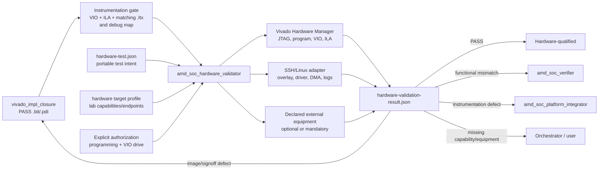

<!--
Copyright (C) 2026, Advanced Micro Devices, Inc. All rights reserved.
SPDX-License-Identifier: MIT
-->

# AMD Adaptive SoC Hardware Validation Standard v0.1

Status: prototype baseline
Last updated: 2026-07-29

## Purpose

This standard makes hardware validation portable across customer laboratories
without pretending their boards, carriers, operating systems, cables, or
peripherals are identical.

It separates three concerns:

1. `hardware-test.json` describes what a design requires and how it passes.
2. A hardware target profile describes what a laboratory can provide.
3. `hardware-validation-result.json` records what actually happened.

The hardware validator runs only when the test requirements are a subset of
the selected target profile's capabilities.

## Workflow

## Portable contract

### Design-side requirements

Every hardware-qualified design must provide:

- a programming image;
- a matching `debug_nets.ltx` from the same implemented build;
- a logical-to-physical debug probe map;
- one or more VIO cores;
- one or more ILA/System ILA cores, one per observed clock domain;
- a board-independent deterministic self-test path;
- bounded test completion;
- explicit pass and error-code status; and
- a safe cleanup state.

The regression runner builds this same instrumentation set under the
`hardware_ready` profile before any board access. A hardware-test plan may
therefore exist without a hardware-validation result; it becomes
`hardware_qualified` only after serialized programming, probe drive, evidence
capture, and cleanup pass.

The standard logical VIO interface is:

| Direction | Logical probe | Purpose | Safe initial value |
|---|---|---|---|
| Host to design | `hw_test_reset` | Hold the test shell in reset | asserted |
| Host to design | `hw_test_start` | Start exactly one test | `0` |
| Host to design | `hw_test_enable` | Enable the stimulus adapter | `0` |
| Design to host | `hw_test_busy` | Test in progress | observed |
| Design to host | `hw_test_done` | Bounded completion | observed |
| Design to host | `hw_test_pass` | Aggregate mandatory result | observed |
| Design to host | `hw_test_error_code` | First deterministic failure | observed |

Each ILA has at least 1024 samples and observes test start, DUT activity,
completion, pass, and error code. AXI and AXI4-Stream designs use System ILA
interface monitoring where practical.

### Traffic adapters

VIO is a control/status mechanism, not a high-rate traffic generator.

| Design class | Stimulus adapter | Observation |
|---|---|---|
| Scalar, counter, watchdog, native FIFO, BRAM | VIO/native test shell | VIO status plus ILA |
| AXI4-Lite register block | JTAG-to-AXI or PS AXI | System ILA plus self-check status |
| AXI4-Stream, DMA, DSP | PS software and DMA, or on-chip traffic generator | System ILA plus buffer comparison |
| Video generator | On-chip deterministic generator | System ILA and frame/line counters |
| MIPI/display pipeline | Mandatory synthetic internal path; optional physical camera/display profile | System ILA plus optional external evidence |
| Multiple clock domains | Separate VIO and ILA per clock domain | Cross-domain completion/status contract |

The mandatory synthetic path separates DUT validation from a customer's
camera, display, cabling, or sensor initialization. Physical-peripheral testing
is an additional qualification profile, not the only way to test the logic.

## Target profile

A target profile declares capabilities rather than prescribing a universal
laboratory:

- exact device part and board part;
- carrier identity when relevant;
- available transports: SSH, JTAG, UART, or XVC;
- programming backends: Vivado Hardware Manager, Linux FPGA Manager, or boot
  image;
- debug capabilities: ILA, VIO, JTAG-to-AXI, and SysMon;
- stimulus capabilities: VIO, PS software, DMA, on-chip generators, and
  external equipment;
- environment-variable names for endpoints; and
- local safety and cleanup policy.

Credentials never appear in the target profile or result artifacts.

Each connected peripheral is a typed instance containing its connector,
carrier route, protocol, interface parameters, component identity,
capabilities, operator confirmations, discovery checks, functional checks, and
evidence provenance. Its lifecycle is `declared` → `discovered` → `validated`.
Documentation that a camera or codec is supported establishes compatibility,
not present-day enumeration or function.

The example profile is `hardware/targets/kv260-lab.example.json`.
The concrete office profile for the AR1335 camera on J7/IAS0 and Digilent Pmod
I2S2 on J2 is
`hardware/targets/kv260-office-ar1335-i2s2.json`.

For physical-peripheral qualification:

- a camera first passes a deterministic sensor/ISP test-pattern capture, then
  a bounded live-frame test;
- audio first passes digital I2S framing/sample/DMA checks, then any analog
  input/output check; and
- a microphone connected to a line input must provide a compatible line-level
  signal or use appropriate bias/preamplification; connector presence alone
  does not prove usable capture amplitude; and
- speaker output requires a confirmed powered or amplified line-level load
  and manual or instrumented physical evidence. Internal I2S activity alone is
  not proof of audible output.

## Programming backends

Two backends are standard:

### Vivado Hardware Manager

Use for rapid development, matching `.ltx` association, VIO interaction, and
ILA capture. `hw_server` runs on the machine that physically sees the JTAG
adapter, or on a declared remote lab host.

### Linux FPGA Manager

Use for deployment-like testing through SSH and a device-tree overlay. It does
not replace the JTAG path required by traditional Vivado ILA/VIO unless an
explicit XVC/debug path is part of the platform.

A mature regression should eventually execute both backends for representative
designs: JTAG for debug qualification and Linux FPGA Manager for deployment
qualification.

## Required execution sequence

1. Validate schemas and capability compatibility.
2. Discover endpoints read-only.
3. Verify target identity.
4. Verify image, `.ltx`, and debug-map hashes.
5. Obtain explicit authorization.
6. Quiesce software and drivers.
7. Program the device.
8. Associate `.ltx`, refresh, and inventory cores/probes.
9. Synchronize/reset VIO outputs.
10. Capture one immediate ILA trace.
11. Configure deterministic stimulus and trigger.
12. Arm ILA.
13. Drive VIO start in a separate Hardware Manager operation.
14. Wait with a timeout.
15. Read status, upload ILA, and collect software results.
16. Evaluate every mandatory criterion.
17. Restore a safe state and record cleanup.

## Evidence and status

`PASS` requires:

- target part matches;
- programming succeeds;
- matching VIO and ILA cores are discovered;
- an immediate ILA capture succeeds;
- the deterministic test completes;
- `hw_test_pass == 1`;
- `hw_test_error_code == 0`;
- required captures and logs exist with hashes; and
- cleanup passes.

`BLOCKED` means missing authorization, equipment, target access, or a required
capability. `FAIL` means the test executed and a criterion failed. `ERROR`
means the validation infrastructure malfunctioned. These statuses are never
averaged together.

## Ownership

| Finding | Owner |
|---|---|
| Hardware access, programming, VIO/ILA operation, cleanup | `amd_soc_hardware_validator` |
| Missing test shell, logical VIO/ILA insertion, BD access, insertion report, AXI/DMA access | `amd_soc_platform_integrator` |
| Missing/mismatched `.ltx`, implemented debug-core identity, final debug map, or build hash | `vivado_impl_closure` |
| Incorrect RTL behavior | `vivado_rtl_engineer` |
| Incorrect HLS/AIE/software behavior | Corresponding implementation agent |
| Incorrect test oracle or expected result | `amd_soc_verifier` |
| Image, placement, routing, timing, or debug-core implementation | `vivado_impl_closure` |
| Incompatible architecture or resource budget | `amd_soc_architect` |
| Missing equipment or consequential environment choice | Orchestrator and user |

## KV260 readiness

All 20 KV260 cases now have schema-valid `hardware-test.json` plans requiring
traditional VIO and ILA.

The previously generated campaign bitstreams remain design-complete artifacts,
not hardware-qualified images:

- ranks 1–19 have programming images but must be rebuilt with the standard test
  shell, both VIO and ILA, matching `.ltx`, and debug maps;
- a fresh Vivado MCP inspection confirmed rank 10 currently contains two VIO
  cores but no ILA; and
- rank 20 still requires the authoritative carrier constraints and clocking
  architecture repair identified by its implementation report.

No hardware PASS can be claimed until the board is connected and the on-target
agent produces a schema-valid PASS result.
